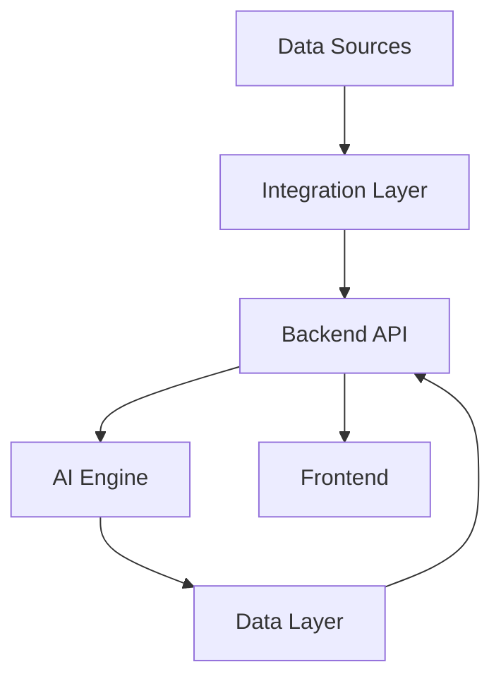

# Architecture

Describe the architecture of RiskSense AI here.
## Overview

RiskSense AI is designed as a modular, scalable platform for risk analysis and management. The architecture leverages microservices, cloud-native technologies, and AI-driven analytics to deliver robust, real-time insights.

## Components

- **Frontend**: A React-based web application provides an intuitive user interface for risk visualization, reporting, and management.
- **Backend API**: Built with FastAPI (Python), the backend exposes RESTful endpoints for data ingestion, processing, and retrieval.
- **AI Engine**: Utilizes machine learning models for risk scoring, anomaly detection, and predictive analytics. Models are trained and served using TensorFlow and PyTorch.
- **Data Layer**: Employs PostgreSQL for structured data and MongoDB for unstructured data. Data pipelines are orchestrated with Apache Airflow.
- **Integration Layer**: Supports integration with external systems (SIEM, vulnerability scanners, ticketing tools) via secure APIs and message queues (RabbitMQ).
- **Security**: Implements OAuth2 for authentication, RBAC for authorization, and end-to-end encryption for data in transit and at rest.
- **Deployment**: Containerized using Docker and orchestrated with Kubernetes for high availability and scalability.

## Data Flow

1. Data sources (logs, vulnerabilities, assets) are ingested via connectors.
2. Data is normalized and stored in the data layer.
3. The AI engine processes data for risk scoring and analytics.
4. Results are exposed via the backend API and visualized in the frontend.

## Scalability & Reliability

- Horizontal scaling of microservices ensures performance under load.
- Automated monitoring and alerting via Prometheus and Grafana.
- Continuous integration and deployment pipelines enable rapid updates.

## Diagram

